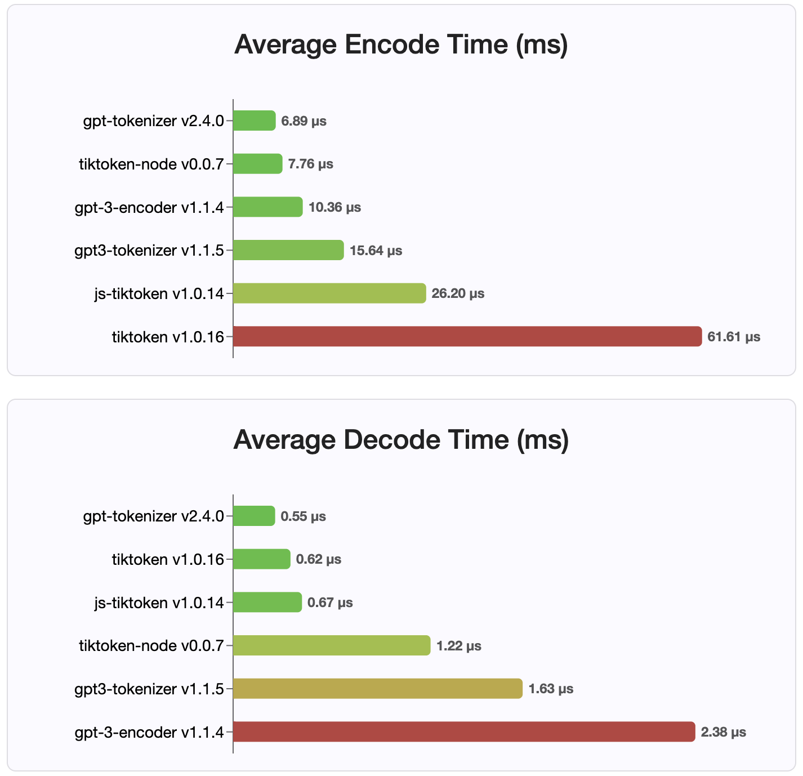
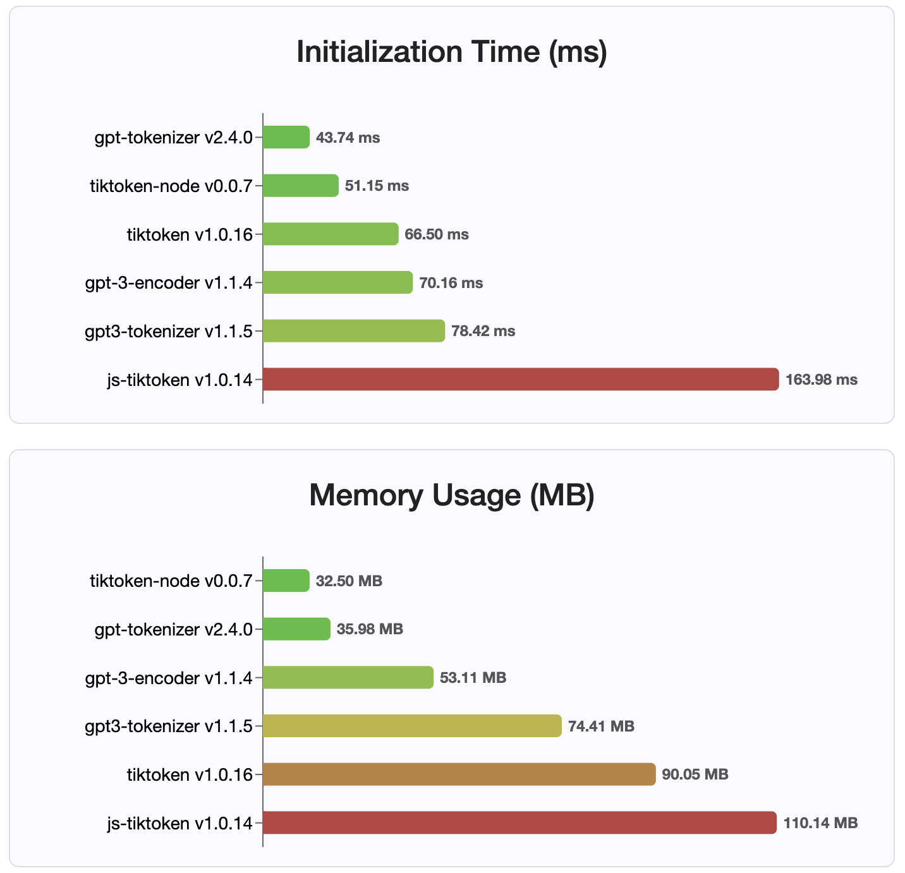

# gpt-tokenizer

[](https://codesandbox.io/s/gpt-tokenizer-tjcjoz?fontsize=14&hidenavigation=1&theme=dark)

`gpt-tokenizer` is a Token Byte Pair Encoder/Decoder supporting all OpenAI's models (including GPT-3.5, GPT-4, GPT-4o, and o1).
It's the [_fastest, smallest and lowest footprint_](#benchmarks) GPT tokenizer available for all JavaScript environments. It's written in TypeScript.

This library has been trusted by:

- [CodeRabbit](https://www.coderabbit.ai/) (sponsor 🩷)
- Microsoft ([Teams](https://github.com/microsoft/teams-ai), [GenAIScript](https://github.com/microsoft/genaiscript/))
- Elastic ([Kibana](https://github.com/elastic/kibana))
- [Effect TS](https://effect.website/)
- [Rivet](https://github.com/Ironclad/rivet) by Ironclad

Please consider [🩷 sponsoring](https://github.com/sponsors/niieani) the project if you find it useful.

#### Features

As of 2023, it is the most feature-complete, open-source GPT tokenizer on NPM. This package is a port of OpenAI's [tiktoken](https://github.com/openai/tiktoken), with some additional, unique features sprinkled on top:

- Support for easily tokenizing chats thanks to the `encodeChat` function
- Support for all current OpenAI models (available encodings: `r50k_base`, `p50k_base`, `p50k_edit`, `cl100k_base` and `o200k_base`)
- Can be loaded and work synchronously! (i.e. in non async/await contexts)
- Generator function versions of both the decoder and encoder functions
- Provides the ability to decode an asynchronous stream of data (using `decodeAsyncGenerator` and `decodeGenerator` with any iterable input)
- No global cache (no accidental memory leaks, as with the original GPT-3-Encoder implementation)
- Includes a highly performant `isWithinTokenLimit` function to assess token limit without encoding the entire text/chat
- Improves overall performance by eliminating transitive arrays
- Type-safe (written in TypeScript)
- Works in the browser out-of-the-box

## Installation

### As NPM package

```bash
npm install gpt-tokenizer
```

### As a UMD module

```html
<script src="https://unpkg.com/gpt-tokenizer"></script>

<script>
  // the package is now available as a global:
  const { encode, decode } = GPTTokenizer_cl100k_base
</script>
```

If you wish to use a custom encoding, fetch the relevant script.

- https://unpkg.com/gpt-tokenizer/dist/o200k_base.js (for `gpt-4o` and `o1`)
- https://unpkg.com/gpt-tokenizer/dist/cl100k_base.js (for `gpt-4-*` and `gpt-3.5-turbo`)
- https://unpkg.com/gpt-tokenizer/dist/p50k_base.js
- https://unpkg.com/gpt-tokenizer/dist/p50k_edit.js
- https://unpkg.com/gpt-tokenizer/dist/r50k_base.js

The global name is a concatenation: `GPTTokenizer_${encoding}`.

Refer to [supported models and their encodings](#Supported-models-and-their-encodings) section for more information.

## Playground

The playground is published under a memorable URL: https://gpt-tokenizer.dev/

You can play with the package in the browser using the CodeSandbox [Playground](https://codesandbox.io/s/gpt-tokenizer-tjcjoz?fontsize=14&hidenavigation=1&theme=dark).

[](https://codesandbox.io/s/gpt-tokenizer-tjcjoz?fontsize=14&hidenavigation=1&theme=dark)

The playground mimics the official [OpenAI Tokenizer](https://platform.openai.com/tokenizer).

## Usage

The library provides various functions to transform text into (and from) a sequence of integers (tokens) that can be fed into an LLM model. The transformation is done using a Byte Pair Encoding (BPE) algorithm used by OpenAI.

```typescript
import {
  encode,
  encodeChat,
  decode,
  isWithinTokenLimit,
  encodeGenerator,
  decodeGenerator,
  decodeAsyncGenerator,
} from 'gpt-tokenizer'
// note: depending on the model, import from the respective file, e.g.:
// import {...} from 'gpt-tokenizer/model/gpt-4o'

const text = 'Hello, world!'
const tokenLimit = 10

// Encode text into tokens
const tokens = encode(text)

// Decode tokens back into text
const decodedText = decode(tokens)

// Check if text is within the token limit
// returns false if the limit is exceeded, otherwise returns the actual number of tokens (truthy value)
const withinTokenLimit = isWithinTokenLimit(text, tokenLimit)

// Example chat:
const chat = [
  { role: 'system', content: 'You are a helpful assistant.' },
  { role: 'assistant', content: 'gpt-tokenizer is awesome.' },
] as const

// Encode chat into tokens
const chatTokens = encodeChat(chat)

// Check if chat is within the token limit
const chatWithinTokenLimit = isWithinTokenLimit(chat, tokenLimit)

// Encode text using generator
for (const tokenChunk of encodeGenerator(text)) {
  console.log(tokenChunk)
}

// Decode tokens using generator
for (const textChunk of decodeGenerator(tokens)) {
  console.log(textChunk)
}

// Decode tokens using async generator
// (assuming `asyncTokens` is an AsyncIterableIterator<number>)
for await (const textChunk of decodeAsyncGenerator(asyncTokens)) {
  console.log(textChunk)
}
```

By default, importing from `gpt-tokenizer` uses `cl100k_base` encoding, used by `gpt-3.5-turbo` and `gpt-4`.

To get a tokenizer for a different model, import it directly, for example:

```ts
import {
  encode,
  decode,
  isWithinTokenLimit,
  // etc...
} from 'gpt-tokenizer/model/gpt-3.5-turbo'
```

If you're dealing with a resolver that doesn't support package.json `exports` resolution, you might need to import from the respective `cjs` or `esm` directory, e.g.:

```ts
import {
  encode,
  decode,
  isWithinTokenLimit,
  // etc...
} from 'gpt-tokenizer/cjs/model/gpt-3.5-turbo'
```

#### Lazy loading

If you don't mind loading the tokenizer asynchronously, you can use a dynamic import inside your function, like so:

```ts
const {
  encode,
  decode,
  isWithinTokenLimit,
  // etc...
} = await import('gpt-tokenizer/model/gpt-3.5-turbo')
```

#### Loading an encoding

If your model isn't supported by the package, but you know which BPE encoding it uses, you can load the encoding directly, e.g.:

```ts
import {
  encode,
  decode,
  isWithinTokenLimit,
  // etc...
} from 'gpt-tokenizer/encoding/cl100k_base'
```

### Supported models and their encodings

- `o1-*` (`o200k_base`)
- `gpt-4o` (`o200k_base`)
- `gpt-4-*` (`cl100k_base`)
- `gpt-3.5-turbo` (`cl100k_base`)
- `text-davinci-003` (`p50k_base`)
- `text-davinci-002` (`p50k_base`)
- `text-davinci-001` (`r50k_base`)
- ...and many other models, see [models.ts](./src/models.ts) for an up-to-date list of supported models and their encodings.

Note: if you're using `gpt-3.5-*` or `gpt-4-*` and don't see the model you're looking for, use the `cl100k_base` encoding directly.

## API

### `encode(text: string): number[]`

Encodes the given text into a sequence of tokens. Use this method when you need to transform a piece of text into the token format that the GPT models can process.

Example:

```typescript
import { encode } from 'gpt-tokenizer'

const text = 'Hello, world!'
const tokens = encode(text)
```

### `decode(tokens: number[]): string`

Decodes a sequence of tokens back into text. Use this method when you want to convert the output tokens from GPT models back into human-readable text.

Example:

```typescript
import { decode } from 'gpt-tokenizer'

const tokens = [18435, 198, 23132, 328]
const text = decode(tokens)
```

### `isWithinTokenLimit(text: string, tokenLimit: number): false | number`

Checks if the text is within the token limit. Returns `false` if the limit is exceeded, otherwise returns the number of tokens. Use this method to quickly check if a given text is within the token limit imposed by GPT models, without encoding the entire text.

Example:

```typescript
import { isWithinTokenLimit } from 'gpt-tokenizer'

const text = 'Hello, world!'
const tokenLimit = 10
const withinTokenLimit = isWithinTokenLimit(text, tokenLimit)
```

### `encodeChat(chat: ChatMessage[], model?: ModelName): number[]`

Encodes the given chat into a sequence of tokens.

If you didn't import the model version directly, or if `model` wasn't provided during initialization, it must be provided here to correctly tokenize the chat for a given model. Use this method when you need to transform a chat into the token format that the GPT models can process.

Example:

```typescript
import { encodeChat } from 'gpt-tokenizer'

const chat = [
  { role: 'system', content: 'You are a helpful assistant.' },
  { role: 'assistant', content: 'gpt-tokenizer is awesome.' },
]
const tokens = encodeChat(chat)
```

Note that if you encode an empty chat, it will still contain the minimum number of special tokens.

### `encodeGenerator(text: string): Generator<number[], void, undefined>`

Encodes the given text using a generator, yielding chunks of tokens.
Use this method when you want to encode text in chunks, which can be useful for processing large texts or streaming data.

Example:

```typescript
import { encodeGenerator } from 'gpt-tokenizer'

const text = 'Hello, world!'
const tokens = []
for (const tokenChunk of encodeGenerator(text)) {
  tokens.push(...tokenChunk)
}
```

### `encodeChatGenerator(chat: Iterator<ChatMessage>, model?: ModelName): Generator<number[], void, undefined>`

Same as `encodeChat`, but uses a generator as output, and may use any iterator as the input `chat`.

### `decodeGenerator(tokens: Iterable<number>): Generator<string, void, undefined>`

Decodes a sequence of tokens using a generator, yielding chunks of decoded text.
Use this method when you want to decode tokens in chunks, which can be useful for processing large outputs or streaming data.

Example:

```typescript
import { decodeGenerator } from 'gpt-tokenizer'

const tokens = [18435, 198, 23132, 328]
let decodedText = ''
for (const textChunk of decodeGenerator(tokens)) {
  decodedText += textChunk
}
```

### `decodeAsyncGenerator(tokens: AsyncIterable<number>): AsyncGenerator<string, void, undefined>`

Decodes a sequence of tokens asynchronously using a generator, yielding chunks of decoded text. Use this method when you want to decode tokens in chunks asynchronously, which can be useful for processing large outputs or streaming data in an asynchronous context.

Example:

```javascript
import { decodeAsyncGenerator } from 'gpt-tokenizer'

async function processTokens(asyncTokensIterator) {
  let decodedText = ''
  for await (const textChunk of decodeAsyncGenerator(asyncTokensIterator)) {
    decodedText += textChunk
  }
}
```

## Special tokens

There are a few special tokens that are used by the GPT models.
Not all models support all of these tokens.

### Custom Allowed Sets

`gpt-tokenizer` allows you to specify custom sets of allowed special tokens when encoding text. To do this, pass a
`Set` containing the allowed special tokens as a parameter to the `encode` function:

```ts
import {
  EndOfPrompt,
  EndOfText,
  FimMiddle,
  FimPrefix,
  FimSuffix,
  ImStart,
  ImEnd,
  ImSep,
  encode,
} from 'gpt-tokenizer'

const inputText = `Some Text ${EndOfPrompt}`
const allowedSpecialTokens = new Set([EndOfPrompt])
const encoded = encode(inputText, allowedSpecialTokens)
const expectedEncoded = [8538, 2991, 220, 100276]

expect(encoded).toBe(expectedEncoded)
```

### Custom Disallowed Sets

Similarly, you can specify custom sets of disallowed special tokens when encoding text. Pass a `Set`
containing the disallowed special tokens as a parameter to the `encode` function:

```ts
import { encode, EndOfText } from 'gpt-tokenizer'

const inputText = `Some Text ${EndOfText}`
const disallowedSpecial = new Set([EndOfText])
// throws an error:
const encoded = encode(inputText, undefined, disallowedSpecial)
```

In this example, an Error is thrown, because the input text contains a disallowed special token.

## Testing and Validation

`gpt-tokenizer` includes a set of test cases in the [TestPlans.txt](./data/TestPlans.txt) file to ensure its compatibility with OpenAI's Python `tiktoken` library. These test cases validate the functionality and behavior of `gpt-tokenizer`, providing a reliable reference for developers.

Running the unit tests and verifying the test cases helps maintain consistency between the library and the original Python implementation.

### Model Information

`gpt-tokenizer` provides comprehensive data about all OpenAI models through the `models` export from [`gpt-tokenizer/models`](./src/models.ts). This includes detailed information about context windows, costs, training data cutoffs, and deprecation status.

The data is regularly maintained to match OpenAI's official documentation. Contributions to keep this data up-to-date are welcome - if you notice any discrepancies or have updates, please feel free to open a PR.

## [Benchmarks](https://l8j6fv.csb.app/)

Since version 2.4.0, `gpt-tokenizer` is the fastest tokenizer implementation available on NPM. It's even faster than the available WASM/node binding implementations.
It has the fastest encoding, decoding time and a tiny memory footprint. It also initializes faster than all other implementations.

The encodings themselves are also the smallest in size, due to the compact format they are stored in.





## License

MIT

## Contributing

Contributions are welcome! Please open a pull request or an issue to discuss your bug reports, or use the discussions feature for ideas or any other inquiries.

## Thanks

Thanks to @dmitry-brazhenko's [SharpToken](https://github.com/dmitry-brazhenko/SharpToken), whose code was served as a reference for the port.

Hope you find the `gpt-tokenizer` useful in your projects!
